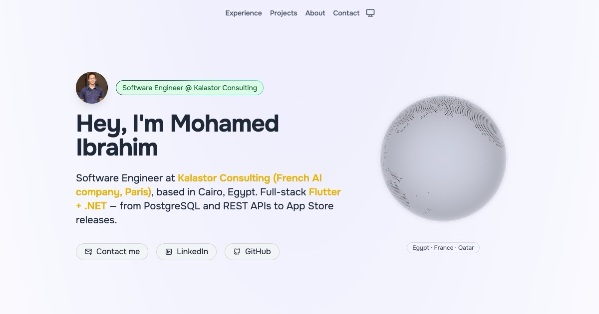
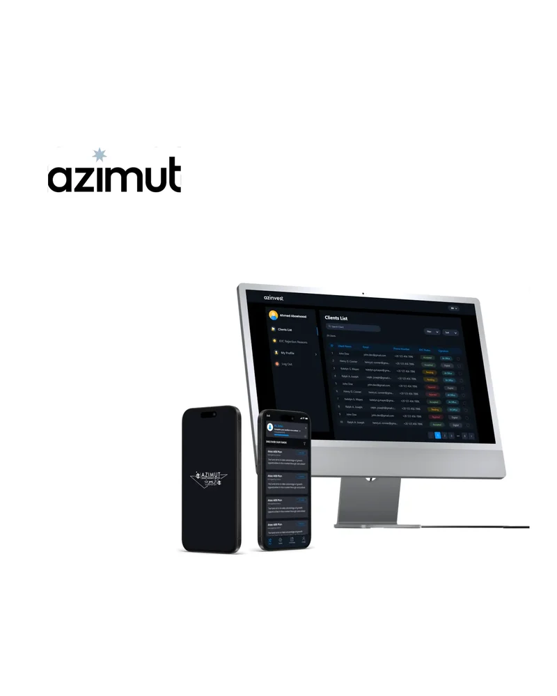
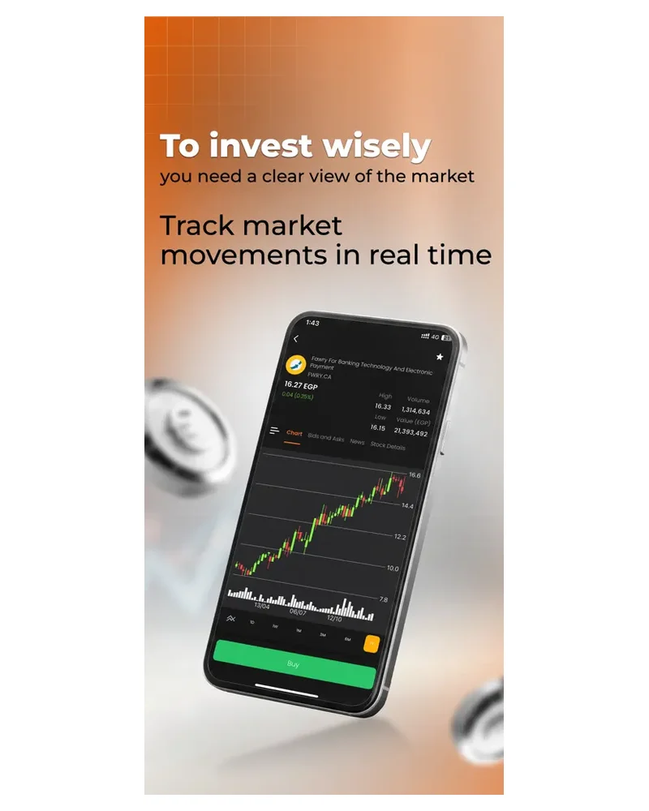
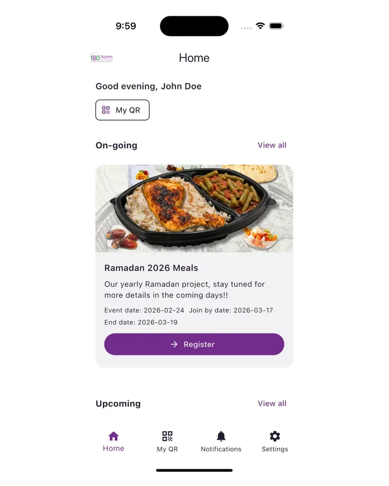
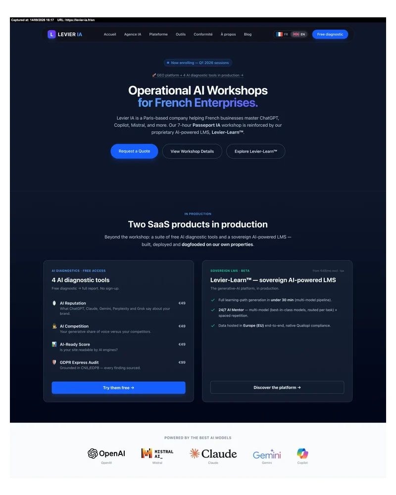

  

  
  
  
  

  
  
  
  

Cairo, Egypt (GMT+3) · Full EU/UK overlap · Open to remote worldwide

---

### Shipped Apps

<table>
  <tr>
    <td align="center" width="33%">
        
      <b>QMotor</b> Flutter · Qatar's #1 auto marketplace · 500K+ users 
      <a href="https://apps.apple.com/eg/app/qmotor-%D9%83%D9%8A%D9%88%D9%85%D9%88%D8%AA%D8%B1/id1060733186">App Store</a> · <a href="https://play.google.com/store/apps/details?id=com.innovitics.qmotorsApp">Google Play</a>
    </td>
    <td align="center" width="33%">
        
      <b>AzInvest</b> Flutter · Azimut Egypt fund platform (€80B+ AUM) 
      <a href="https://apps.apple.com/eg/app/azinvest-save-invest/id6448698545">App Store</a> · <a href="https://play.google.com/store/apps/details?id=com.innovitics.azinvest">Google Play</a>
    </td>
    <td align="center" width="33%">
        
      <b>Naeem GO</b> Flutter · Gulf retail investing · live tickers 
      <a href="https://apps.apple.com/us/app/naeem-go-invest-grow-wealth/id6758153382">App Store</a> · <a href="https://play.google.com/store/apps/details?id=com.innovitics.naeem.holding">Google Play</a>
    </td>
  </tr>
  <tr>
    <td align="center" width="33%">
        
      <b>180 Degrees Foundation</b> Flutter + Supabase · NGO app · 10K week-one installs 
      <a href="https://apps.apple.com/us/app/180-degrees-foundation/id6758964860">App Store</a> · <a href="https://play.google.com/store/apps/details?id=com.degrees180.degrees180_app">Google Play</a>
    </td>
    <td align="center" width="33%">
        
      <b>Levier-Learn</b> .NET 8 + TypeScript · Production AI LMS I lead · 85% hosting cut 
      <a href="https://levier-ia.fr/en/levier-learn">Live platform</a>
    </td>
    <td align="center" width="33%"></td>
  </tr>
</table>

---

### Tech Stack

**Mobile** &nbsp;

**Backend** &nbsp;

**Web** &nbsp;

**Cloud & DevOps** &nbsp;

---

### What I'm Building

- **[local-is-agentic](https://github.com/Moe1211/local-is-agentic)** — experiments in local-first agent tooling
- **[fleet-manager-monolith](https://github.com/Moe1211/fleet-manager-monolith)** — Python fleet-management service
- **[react-three-fiber-experiments](https://github.com/Moe1211/react-three-fiber-experiments)** — Three.js / WebGL sandbox
- **[json-sanitizer](https://github.com/Moe1211/json-sanitizer)** — Python JSON cleanup utility
- **[dotfiles](https://github.com/Moe1211/dotfiles)** — my shell / macOS setup
